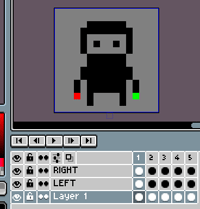
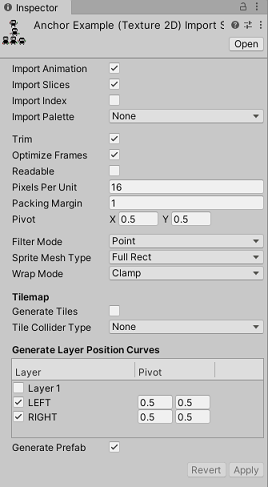

# Yet Another Aseprite Importer for Unity

This package adds Aseprite format (.ase) importer to project.

## Requirements
- Unity 2020.1+

## Features
- Creates animations from timeline.
- Tags creates separate AnimationClips.
- Slices (9 slices & Pivots)
- Slice animation is also supported.
- Import indexed image and palette.
- Import as Unity's tilemap asset. 
- Generates object animation from layer boundaries.

## Screenshots

